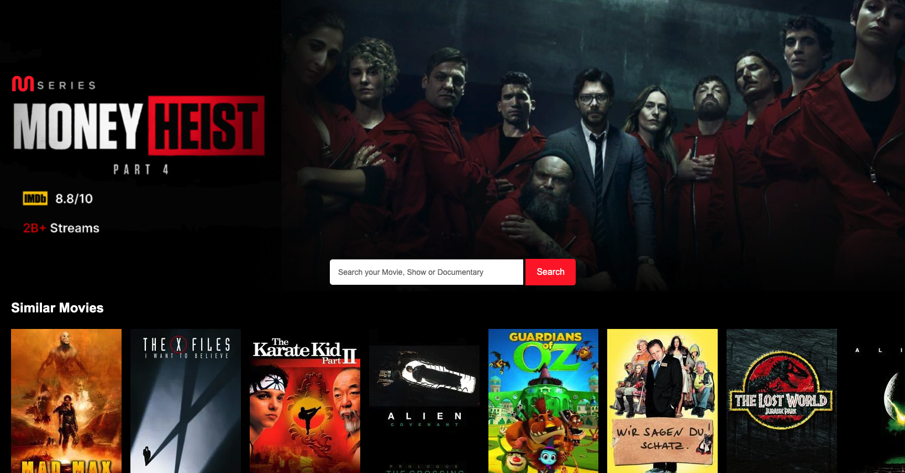

# MatchFlix | Similar Movie Finder

Is a responsive and user friendly web application that allows users to **discover movies similar to a movie of their choice**.  
In this project I use **API integration, dynamic UI updates, and search functionality** to help users explore movies based on their preferences.

- 👉 Live app: https://matchfilx-similar-movie.onrender.com/

---

## Features

- **Movie Search by Title**

  - Users can search for any movie by its **title**
  - the API Fetches the **movie ID** to enable further searches for similar films

- **Discover Similar Movies**

  - Retrieves a **list of similar movies** using the movie ID from a reliable movie database API

- **Error Handling & Feedback**
  - Alerts users when the movie title is invalid or no similar movies are found
  - Ensures a smooth and reliable user experience

---

## Technologies Used

- HTML5
- CSS3 (Responsive layouts and modern UI)
- JavaScript (DOM manipulation, API calls, async handling)
- Movie Database APIs (for movie search and similar movie retrieval)
- JSON (for parsing API responses)

---

## Installation & Usage

1. git clone git@github.com:MassowNdiaye/MatchFilx-Similar-Movie.git

2. npm install

3. node src/server.js (To run locally)

- 👉 Live app: https://matchfilx-similar-movie.onrender.com/
